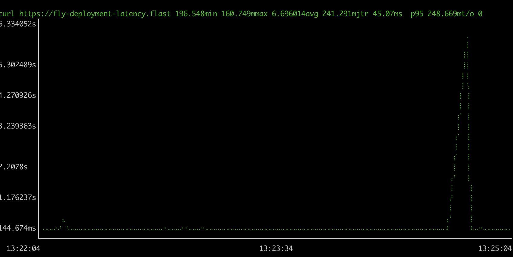

# Reproduction Steps

1. Install gping `brew install gping`
2. Deploy to a fly app `fly deploy`
3. Scale to 2 `fly scale count 2`
4. Start gping `gping --cmd --buffer 180 -n 1 "curl https://fly-deployment-latency.fly.dev/"`
5. Make a small change to the image `echo "  " >> index.js`
6. Kick off a deployment `fly deploy`

This seems to effect both rolling and blue/green deployments.

